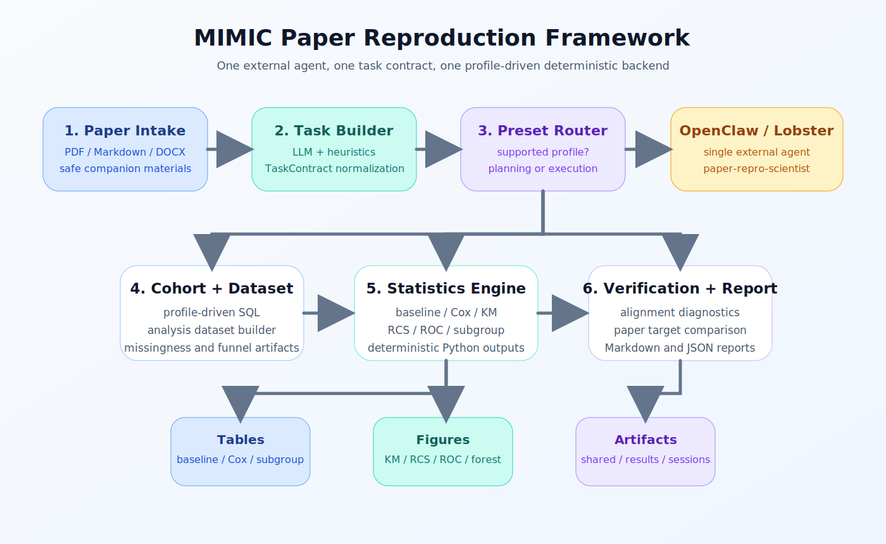
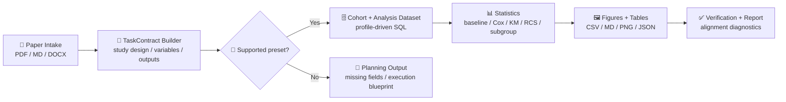

<p align="center">
  
</p>

<h1 align="center">MIMIC Clinical Paper Reproduction Agent</h1>

<p align="center">
  <strong>OpenClaw / Lobster-ready framework for reading a clinical paper, building a TaskContract, running MIMIC SQL and statistics, and exporting paper-like artifacts.</strong>
</p>

<p align="center">
  
  
  
  
  
</p>

<p align="center">
  <a href="#-automation-workflow"><strong>Workflow</strong></a> ·
  <a href="#-execution-modes"><strong>Execution Modes</strong></a> ·
  <a href="#-quick-start"><strong>Quick Start</strong></a> ·
  <a href="#-openclaw-and-lobster"><strong>OpenClaw</strong></a>
</p>

> [!IMPORTANT]
> The project is intentionally `MIMIC-first`, `paper-first`, and `artifact-first`.
> LLMs help read the paper and structure the task. Deterministic SQL and Python produce the actual cohort, tables, figures, and verification outputs.

It is designed for one concrete job:

- take a paper from `papers/`
- read the study design from the paper itself
- connect to MIMIC through PostgreSQL
- build the cohort and analysis dataset
- reproduce tables and figures
- compare reproduced outputs against the paper

The target integration shape is:

- one external agent for OpenClaw / Lobster: `paper-repro-scientist`
- one internal exchange object: `TaskContract`
- one active deterministic backend for supported paper profiles

This repository is now organized around one active path:

1. read the paper from `papers/`
2. extract study design, variables, models, tables, figures, and target results
3. translate the paper into a structured `TaskContract` or a supported paper profile
4. build the MIMIC cohort and analysis dataset
5. run statistics and export paper-like tables and figures
6. compare reproduced results against the paper and write a report

The current goal is practical and narrow:

- `MIMIC-IV`
- `PostgreSQL`
- clinical observational studies
- common survival and regression analyses
- OpenClaw / Lobster integration through one external agent

The right description today is `clinical paper reproduction engine v1`, not a general-purpose paper auto-reproduction platform.

## 🖼️ Framework Snapshot

<p align="center">
  
</p>

## ✨ What This Repository Automates

For supported papers, the repository automates the full paper-to-artifact chain:

1. ingest PDF / Markdown / DOCX paper materials
2. extract cohort logic, variables, models, target tables, target figures, and reported metrics
3. build a structured `TaskContract`
4. detect whether the paper matches a supported preset profile
5. run deterministic MIMIC cohort extraction and analysis dataset construction
6. fit the requested models
7. export paper-like tables and figures
8. save verification artifacts and a reproduction report

## 🧭 Automation Workflow



### 📄 Step 1. Read the paper first

The system does not start by guessing SQL. It starts from the paper.

Paper intake:

- reads files from `papers/`
- supports PDF, Markdown, and DOCX
- attaches only safe companion materials for the same paper
- avoids contamination from old files in the same folder

Implementation:

- [`src/repro_agent/paper_materials.py`](src/repro_agent/paper_materials.py)

### 🧠 Step 2. Build a machine-readable study contract

The paper text plus user instructions are converted into a normalized `TaskContract`.

This contract is the central object for:

- cohort logic
- exposure and outcome variables
- covariates
- model families
- requested outputs
- verification targets

Implementation:

- [`src/repro_agent/task_builder.py`](src/repro_agent/task_builder.py)

### 🚦 Step 3. Route to deterministic execution or planning

After contract building, the system decides whether to:

- bridge into a supported deterministic paper profile
- or stay in planning-first mode and report what is still missing

Implementation:

- [`src/repro_agent/openclaw_bridge.py`](src/repro_agent/openclaw_bridge.py)
- [`src/repro_agent/preset_registry.py`](src/repro_agent/preset_registry.py)
- [`src/repro_agent/paper_profiles.py`](src/repro_agent/paper_profiles.py)

### 🗄️ Step 4. Build the cohort and analysis dataset

For supported profiles, the active execution path is profile-driven:

- [`scripts/profiles/build_profile_cohort.py`](scripts/profiles/build_profile_cohort.py)
- [`scripts/profiles/build_profile_analysis_dataset.py`](scripts/profiles/build_profile_analysis_dataset.py)

These steps connect to MIMIC, apply paper-specific cohort logic, and export the model-ready dataset.

### 📊 Step 5. Run statistics and generate paper-like outputs

The current active statistics layer exports:

- baseline tables in CSV and Markdown
- Cox model tables in CSV and Markdown
- subgroup analysis tables in CSV and Markdown
- cohort funnel and missingness summaries in JSON
- Kaplan-Meier plots in PNG
- restricted cubic spline plots in PNG
- ROC plots in PNG
- subgroup forest plots in PNG

Implementation:

- [`scripts/profiles/run_profile_stats.py`](scripts/profiles/run_profile_stats.py)
- [`src/repro_agent/profile_stats.py`](src/repro_agent/profile_stats.py)

### ✅ Step 6. Verify against the paper

The workflow saves structured artifacts that make alignment debugging possible:

- paper-derived targets
- cohort alignment summaries
- stats summaries
- final report artifacts

This is the main path we use to understand where a reproduction run matches the paper and where it diverges.

## 🧠 LLM vs Deterministic Execution

The intended split is strict:

- LLM is used for paper understanding, field extraction, and contract completion
- deterministic Python and SQL are used for database access, cohort building, statistics, and figure generation

The repository should not use LLMs to fabricate cohort logic, execute statistics, or invent results.

## 📦 What A Run Produces

For a successful supported run, expected artifacts include:

- cohort CSV
- cohort funnel JSON
- analysis dataset CSV
- missingness JSON
- baseline table CSV and Markdown
- Cox results table CSV and Markdown
- subgroup analysis table CSV and Markdown
- Kaplan-Meier, RCS, ROC, and subgroup forest figures
- stats summary JSON
- reproduction report Markdown

Typical output roots:

- `shared/`
- `results/`
- `shared/runs/<paper_profile>/<run_label>/`
- `results/runs/<paper_profile>/<run_label>/`
- `shared/sessions/<session_id>/`

## 🧩 Core Concepts

- `TaskContract`
  The main exchange object for cohort logic, variables, models, outputs, and verification targets.
- `PaperExecutionProfile`
  A deterministic paper-specific execution contract for supported studies.
- `AgentRunner`
  The internal executor that persists session state, routes enabled skills, and bridges supported tasks into deterministic execution.
- `OpenClaw Bridge`
  The stable external interface for `plan_task`, `run_task`, `export_contract`, `run_preset_pipeline`, and `extract_analysis_dataset`.

## 🚧 Current Status

Already working well:

- PDF / Markdown / DOCX paper intake
- LLM-backed `TaskContract` construction with heuristic fallback
- preset registry and semantic mapping scaffold
- profile-driven MIMIC cohort extraction and analysis dataset construction
- baseline table, KM, Cox, RCS, ROC, subgroup, and alignment outputs for supported profiles
- OpenClaw-facing SOUL file, skills, and bridge contracts

Still in progress:

- non-preset MIMIC papers are plannable but not yet fully executable end to end
- table and supplement parsing still need stronger normalization into machine-verifiable targets
- generic cohort compilation from arbitrary paper text is not fully automatic yet
- some study families still need broader deterministic coverage

## ▶️ Execution Modes

### ⚙️ Deterministic Profile Path

Use this when a paper is already represented as a supported execution profile.

Key assets:

- [`src/repro_agent/paper_profiles.py`](src/repro_agent/paper_profiles.py)
- [`scripts/profiles/build_profile_cohort.py`](scripts/profiles/build_profile_cohort.py)
- [`scripts/profiles/build_profile_analysis_dataset.py`](scripts/profiles/build_profile_analysis_dataset.py)
- [`scripts/profiles/run_profile_stats.py`](scripts/profiles/run_profile_stats.py)

Typical commands:

```bash
python3 scripts/profiles/build_profile_cohort.py --help
python3 scripts/profiles/build_profile_analysis_dataset.py --help
python3 scripts/profiles/run_profile_stats.py --help
```

Typical run pattern:

```bash
python3 scripts/profiles/build_profile_cohort.py \
  --profile mimic_nlr_sepsis_elderly

python3 scripts/profiles/build_profile_analysis_dataset.py \
  --profile mimic_nlr_sepsis_elderly

python3 scripts/profiles/run_profile_stats.py \
  --profile mimic_nlr_sepsis_elderly
```

### 🤖 Agentic / OpenClaw Path

Use this when the system needs to read a paper, build a contract, and decide whether the task is executable now or should remain planning-first.

Key assets:

- [`configs/agentic.example.yaml`](configs/agentic.example.yaml)
- [`configs/openclaw.agentic.yaml`](configs/openclaw.agentic.yaml)
- [`configs/openclaw.mimic-real-run.yaml`](configs/openclaw.mimic-real-run.yaml)
- [`configs/mimic_variable_semantics.yaml`](configs/mimic_variable_semantics.yaml)
- [`openclaw/SOUL.MD`](openclaw/SOUL.MD)
- [`openclaw/skills/skills_manifest.yaml`](openclaw/skills/skills_manifest.yaml)

Typical commands:

```bash
paper-repro plan-task \
  --config configs/agentic.example.yaml \
  --paper-path papers/your-paper.pdf \
  --instructions "Read the paper and extract the cohort, exposure, outcome, models, tables, figures, and requested outputs."
```

```bash
paper-repro run-task \
  --config configs/agentic.example.yaml \
  --session-id <session_id>
```

Recommended automation pattern for a new paper:

1. `plan-task`
2. inspect `missing_high_impact_fields`
3. inspect `execution_supported`
4. if it is a supported preset, run the deterministic path
5. otherwise keep the result as planning output, not fake execution

## 🦞 OpenClaw and Lobster

The repository exposes one external research agent:

- agent name: `paper-repro-scientist`
- soul file: [`openclaw/SOUL.MD`](openclaw/SOUL.MD)
- bridge module: [`src/repro_agent/openclaw_bridge.py`](src/repro_agent/openclaw_bridge.py)

Recommended docs:

- [`docs/architecture.md`](docs/architecture.md)
- [`docs/openclaw_integration.md`](docs/openclaw_integration.md)
- [`docs/lobster_agent_contract.md`](docs/lobster_agent_contract.md)
- [`docs/skills_map.md`](docs/skills_map.md)

Recommended entrypoint contract for Lobster:

1. upload or reference the paper
2. call `plan_task`
3. read the returned `TaskContract`
4. if executable, call `run_task`
5. read artifacts from `shared/` and `results/`

## 🗂️ Project Layout

```text
paper-repro-agent/
├── configs/
├── docs/
│   ├── architecture.md
│   ├── openclaw_integration.md
│   ├── lobster_agent_contract.md
│   ├── skills_map.md
│   └── reference/
├── openclaw/
│   ├── SOUL.MD
│   └── skills/
├── papers/
├── scripts/
│   ├── profiles/
│   ├── legacy/
│   ├── bootstrap_skills.sh
│   └── git_update.sh
├── shared/
├── results/
└── src/repro_agent/
```

Notes:

- `scripts/profiles/` is the active deterministic execution path.
- `scripts/legacy/` is compatibility-only and should not drive new design work.
- `docs/reference/` is historical context, not the source of truth for the current architecture.

## 🚀 Quick Start

1. Copy the env template:

```bash
cp .env.example .env
```

2. Install the package:

```bash
pip install -e .
```

3. Optional: install project-scoped scientific skills:

```bash
bash scripts/bootstrap_skills.sh
```

4. Validate database wiring:

```bash
paper-repro validate-env
paper-repro probe-db
```

5. Build a task contract from a paper:

```bash
paper-repro plan-task \
  --config configs/agentic.example.yaml \
  --paper-path papers/your-paper.pdf \
  --instructions "Read the paper and build a TaskContract for reproduction"
```

6. Inspect the OpenClaw bridge:

```bash
paper-repro describe-openclaw
paper-repro describe-skills
```

7. Run a supported preset pipeline:

```bash
paper-repro run-preset-pipeline --config configs/pipeline.example.yaml
```

8. Publish updates with the fixed git helper:

```bash
bash scripts/git_update.sh "feat: your change summary"
```

## 🔐 Credentials and Security

- Store DB and API keys in environment variables only
- Keep sample values only in `.env.example`
- Never commit raw secrets
- Logs and reports should expose only masked connection details

Current env inputs include:

- `MIMIC_PG_*`
- `OPENAI_API_KEY` or `SILICONFLOW_API_KEY`
- optional `LLM_API_KEY_ENV`
- optional `LLM_BASE_URL`
- optional `LLM_DEFAULT_MODEL`
- optional `LLM_PROVIDER`

## 🧰 Skills

External scientific skills are tracked in [`docs/skills_map.md`](docs/skills_map.md).

OpenClaw-facing local skill docs live under [`openclaw/skills/`](openclaw/skills/).

Current external skill targets:

- `pyhealth`
- `clinicaltrials-database`
- `clinical-reports`
- `statistical-analysis`

## 🚧 Current Boundaries

What works now:

- MIMIC-first paper intake and task planning
- profile-driven cohort and dataset execution for supported papers
- paper-like table and figure export
- artifact-first reporting and alignment tracking
- OpenClaw / Lobster integration scaffold through one external agent

What does not yet fully work:

- arbitrary new MIMIC papers compiled automatically into executable SQL
- fully automatic variable mapping for every paper
- complete non-preset end-to-end execution
- broad support for every clinical study family

## 👥 Contributors

See [CONTRIBUTORS.md](CONTRIBUTORS.md).
