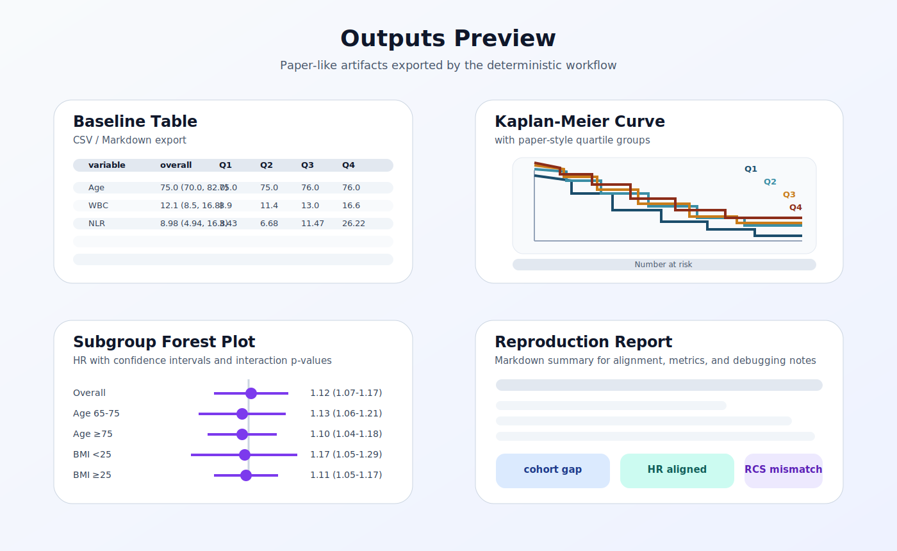

<h1 align="center">MIMIC Clinical Paper Reproduction Agent</h1>

<p align="center">
  <strong>Paper-first, MIMIC-first, artifact-first clinical paper reproduction engine.</strong>
</p>

<p align="center">
  
  
  
  
  
</p>

> [!IMPORTANT]
> This repository is a `MIMIC clinical paper reproduction engine v1`.
> LLMs read papers, resolve ambiguous method semantics, and draft executable plans.
> SQL, cohort extraction, statistics, and figure generation stay deterministic.

## What It Does

For supported MIMIC clinical papers, the repository can:

1. read the paper from `papers/`
2. extract structured paper evidence
3. normalize the study into a `TaskContract`
4. route the task into a supported execution path or a planning-only path
5. build cohort and analysis dataset artifacts
6. generate paper-like tables, figures, and verification outputs
7. persist everything under `shared/`, `results/`, and `shared/sessions/<session_id>/`

The current scope is intentionally narrow:

- `MIMIC-IV`
- `PostgreSQL`
- clinical observational studies
- survival / regression oriented workflows
- OpenClaw or Lobster integration through one external agent

## Framework Snapshot

<p align="center">
  
</p>

## Outputs Preview

<p align="center">
  
</p>

## Source Of Truth

The current source of truth is intentionally small:

- [`docs/architecture.md`](docs/architecture.md)
- [`docs/clinical-analysis-capability-map.md`](docs/clinical-analysis-capability-map.md)
- [`openclaw/SOUL.MD`](openclaw/SOUL.MD)
- [`openclaw/AGENTS.md`](openclaw/AGENTS.md)
- [`openclaw/skills/skills_manifest.yaml`](openclaw/skills/skills_manifest.yaml)

Developer-local `.codex/skills` content is not part of the default product surface anymore.

We do keep a developer-reference skill pool and use it to guide future method
expansion. The current mapping lives in
[`docs/supplemental-codex-skill-map.md`](docs/supplemental-codex-skill-map.md).
The machine-readable bridge that connects those vendored skills back into this
agent lives in
[`openclaw/skills/codex_skill_bridge.yaml`](openclaw/skills/codex_skill_bridge.yaml).

## Core Concepts

- `TaskContract`
  The only primary exchange object between paper intake, planning, execution, and OpenClaw integration.
- `paper_evidence`
  Structured paper facts extracted before normalization.
- `analysis_family_route`
  The method-family routing summary used to distinguish native, hybrid, and planning-only capability.
- `PaperExecutionProfile`
  A supported paper-specific execution contract for deterministic or experimental runnable paths.

## Package Layout

The active code lives under [`src/repro_agent`](src/repro_agent):

- [`src/repro_agent/paper`](src/repro_agent/paper)
  paper intake, normalization, presets, profiles, and templates
- [`src/repro_agent/agentic`](src/repro_agent/agentic)
  agent decision, session runner, and execution planning
- [`src/repro_agent/analysis`](src/repro_agent/analysis)
  stats routing, profile-backed analysis, and trajectory execution
- [`src/repro_agent/registry`](src/repro_agent/registry)
  semantic registry, skill contracts, and analysis-family registry
- [`src/repro_agent/sql`](src/repro_agent/sql)
  cohort and analysis-dataset SQL builders
- [`src/repro_agent/db`](src/repro_agent/db)
  database connection helpers
- [`src/repro_agent/openclaw_bridge.py`](src/repro_agent/openclaw_bridge.py)
  the stable OpenClaw/Lobster-facing bridge

The core implementation modules now live in categorized packages:

- [`src/repro_agent/core`](src/repro_agent/core)
  canonical config, contracts, runtime, and LLM helpers
- [`src/repro_agent/integrations`](src/repro_agent/integrations)
  external orchestration bridges such as OpenClaw

The root-level `config.py`, `contracts.py`, `llm.py`, `runtime.py`, and
`openclaw_bridge.py` are compatibility facades.

The maintained execution scripts are:

- [`scripts/profiles/build_profile_cohort.py`](scripts/profiles/build_profile_cohort.py)
- [`scripts/profiles/build_profile_analysis_dataset.py`](scripts/profiles/build_profile_analysis_dataset.py)
- [`scripts/profiles/run_profile_stats.py`](scripts/profiles/run_profile_stats.py)

## Execution Paths

### 1. Paper-first agentic path

Use this when starting from a new paper.

```bash
paper-repro plan-task \
  --config configs/agentic.example.yaml \
  --paper-path papers/your-paper.pdf \
  --instructions "Read the paper and build a reproduction TaskContract."
```

```bash
paper-repro run-task \
  --config configs/agentic.example.yaml \
  --session-id <session_id>
```

Recommended sequence:

1. `plan-task`
2. inspect `missing_high_impact_fields`
3. inspect `execution_supported` and `recommended_run_profile`
4. if executable, call `run-task`
5. read artifacts from `shared/`, `results/`, and `shared/sessions/<session_id>/`

### 1.1 Lobster single-entrypoint path

Use this when an external orchestrator (for example Lobster/OpenClaw) wants one API-like call.

```bash
paper-repro lobster-request --template agentic_repro
```

```bash
paper-repro lobster-request \
  --request-file configs/lobster.request.agentic-repro.example.json
```

You can also use the other ready-made request files:

- `configs/lobster.request.plan-only.example.json`
- `configs/lobster.request.follow-up.example.json`

### 2. Profile-first deterministic path

Use this when the paper already matches a supported profile.

```bash
python3 scripts/profiles/build_profile_cohort.py --profile mimic_nlr_sepsis_elderly
python3 scripts/profiles/build_profile_analysis_dataset.py --profile mimic_nlr_sepsis_elderly
python3 scripts/profiles/run_profile_stats.py --profile mimic_nlr_sepsis_elderly
```

### 3. Legacy compatibility path

The old `dry-run`, `run`, and `run-preset-pipeline` CLI commands still exist for compatibility,
but they are no longer the recommended interface and are treated as deprecated.

## Supported Profiles Today

The active built-in profiles currently include:

- `mimic_tyg_sepsis`
- `mimic_nlr_sepsis_elderly`
- `mimic_hr_trajectory_sepsis`
- `mimic_tyg_stroke_nondiabetic`

The trajectory profile is explicitly experimental:

- paper-required method: `LGMM`
- engine backend: `trajectory_python_bridge`
- fidelity: `method-aligned, not paper-identical`

The non-diabetic ischemic stroke TyG profile is also experimental:

- engine backend: `profile_survival_bridge`
- paper scope: multi-endpoint mortality survival analysis in MIMIC-IV v3.1
- current method gaps: fasting semantics approximation, coding-based intervention flags, and missing MICE/PSM sensitivity execution

## Artifacts

Stable artifact roots:

- `shared/`
- `results/`
- `shared/runs/<profile>/`
- `results/runs/<profile>/`
- `shared/sessions/<session_id>/`

Typical outputs include:

- cohort CSV and funnel JSON
- analysis dataset CSV and missingness JSON
- baseline / Cox / subgroup tables
- KM / spline / ROC / trajectory figures
- stats summary JSON
- reproduction report Markdown

## Quick Start

1. Copy the environment template:

```bash
cp .env.example .env
```

2. Install the package:

```bash
pip install -e .
```

3. Validate database wiring:

```bash
paper-repro validate-env
paper-repro probe-db
```

4. Optional: validate LLM routing:

```bash
paper-repro probe-llm --config configs/agentic.example.yaml
```

5. Inspect the OpenClaw bridge:

```bash
paper-repro describe-openclaw
paper-repro describe-skills
```

6. Optional: run a Lobster single-entrypoint smoke test:

```bash
paper-repro lobster-request --template plan_only
paper-repro lobster-request --request-file configs/lobster.request.plan-only.example.json
```

## OpenClaw

The repository exposes one external agent:

- agent name: `paper-repro-scientist`
- soul: [`openclaw/SOUL.MD`](openclaw/SOUL.MD)
- operational rules: [`openclaw/AGENTS.md`](openclaw/AGENTS.md)
- machine-readable skill surface: [`openclaw/skills/skills_manifest.yaml`](openclaw/skills/skills_manifest.yaml)

Recommended single-entrypoint interface for external orchestrators:

- `paper-repro lobster-request`
- `configs/lobster.request.plan-only.example.json`
- `configs/lobster.request.agentic-repro.example.json`
- `configs/lobster.request.follow-up.example.json`

The official project-owned skills are:

- `paper_intake_and_contract`
- `mimic_cohort_execution`
- `analysis_dataset_expansion`
- `longitudinal_trajectory_execution`
- `survival_stats_execution`
- `result_figure_generation`
- `paper_alignment_verification`

The repo also ships a supplemental bridge artifact,
[`openclaw/skills/codex_skill_bridge.yaml`](openclaw/skills/codex_skill_bridge.yaml),
that maps vendored `.codex/skills` into OpenClaw stages and adoption lanes.
That bridge is advisory and project-owned, but it does not by itself claim new
runtime execution support.

## Boundaries

What works today:

- paper-first MIMIC intake and contract construction
- hybrid routing between planning and execution
- profile-driven cohort and dataset construction
- deterministic stats and figure generation for supported families
- artifact-first verification and reporting

What does not yet fully work:

- arbitrary new MIMIC papers compiled automatically into executable SQL
- universal variable mapping for every paper
- full end-to-end execution for all non-preset papers
- complete deterministic coverage for every clinical method family

## Security

- Keep DB and API credentials in environment variables only.
- Keep sample values only in `.env.example`.
- Do not commit raw secrets.
- Logs and reports should show masked connection details only.

## Contributors

See [CONTRIBUTORS.md](CONTRIBUTORS.md).
